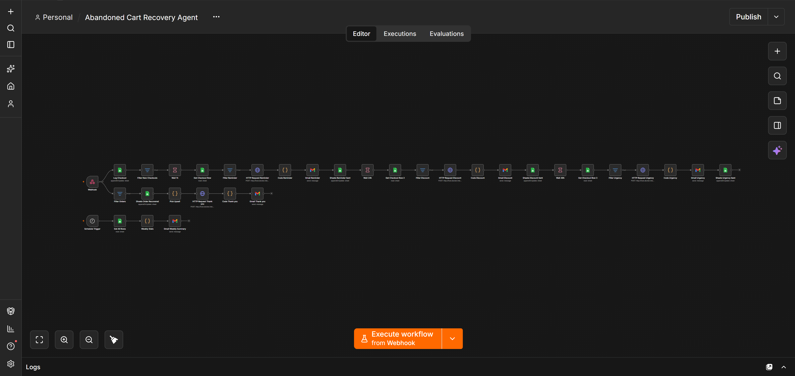
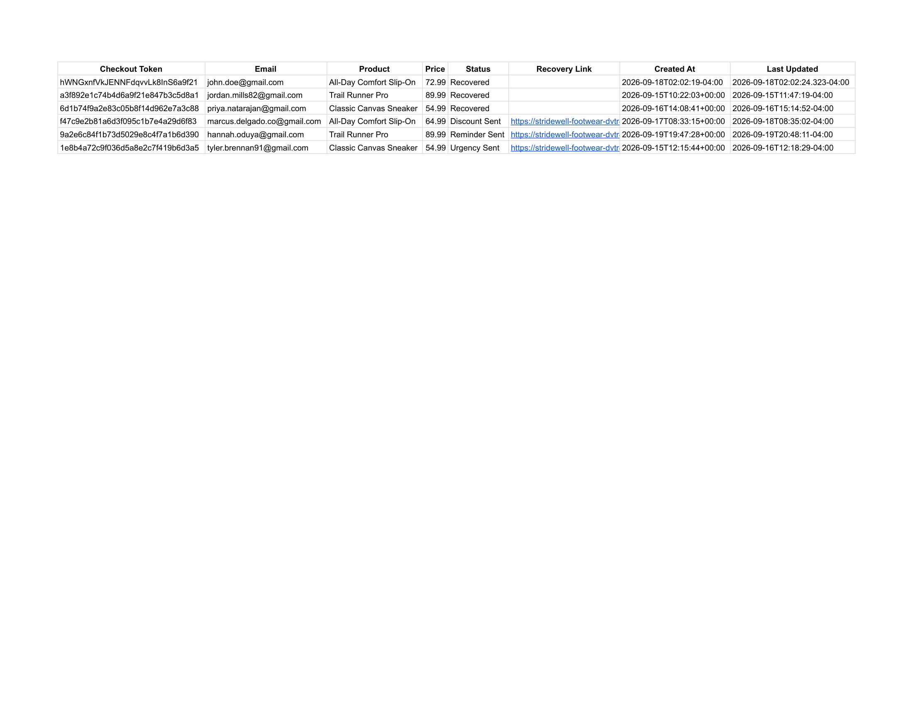
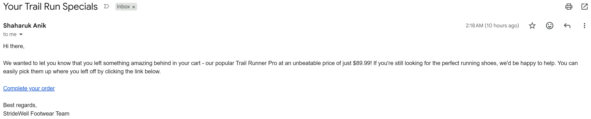
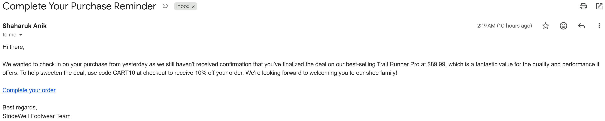
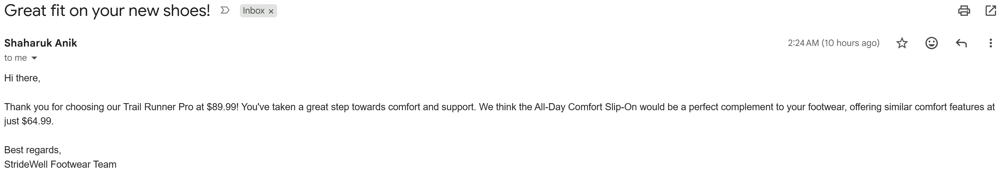
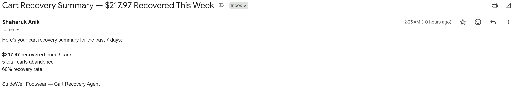

# Abandoned Cart Recovery Agent

> An AI-powered n8n automation that detects abandoned Shopify checkouts, runs a 3-stage AI-personalized recovery sequence (reminder → discount → urgency), and automatically stops the moment a customer completes their purchase — built for **StrideWell Footwear** (demo brand).

## The Problem

Roughly 70% of online shoppers abandon their cart before completing checkout. For a store doing meaningful monthly revenue, that's a large, ongoing amount of money sitting unrecovered — and most small stores do zero automated follow-up on it.

## The Solution

This workflow turns a Shopify checkout the moment it's started into a fully automated, AI-personalized recovery sequence, with zero manual work:

1. Shopify checkout events (creation and updates) are captured via webhooks the instant a customer begins checking out
2. Every checkout is logged to a live Google Sheets tracker, deduplicated by **cart token** — not checkout token, since Shopify can mint a new checkout token mid-session while the underlying cart stays the same
3. If there's no purchase within 1 hour, a local LLM writes a personalized reminder email using the customer's exact product and price — generated fresh each time, never templated
4. Still no action 24 hours later → a second AI-written email offers a 10% discount
5. Still nothing 24 hours after that → a final AI-written email creates urgency around the still-available discount
6. If the customer completes checkout at **any** point, the sequence stops immediately — no further reminders — and a thank-you email goes out instead, with an AI-written upsell suggestion for a different product
7. Every event is logged to the same tracker, so a scheduled weekly report emails the store owner the total carts recovered and dollar amount, every Monday morning

## Tech Stack

- **n8n** — workflow orchestration (self-hosted via Docker)
- **Shopify** — checkout and order webhooks (checkout creation, checkout update, order creation)
- **Ollama (Llama 3.2)** — local, free LLM for all AI-generated email copy during development
- **Google Sheets** — cart recovery tracker and reporting dashboard
- **Gmail** — reminder, discount, urgency, thank-you, and weekly summary emails
- **JavaScript (n8n Code nodes)** — AI response parsing, upsell selection, weekly stats aggregation

> Llama 3.2 (free, local) was used for development and demo purposes. Production client deployments swap in GPT-4o or Claude for higher-quality output — the workflow architecture stays identical.

## Architecture

```
CHECKOUT BRANCH
1. Webhook                     (checkout creation + checkout update)
        ↓
2. Log Checkout                 (Google Sheets — append/update, matched on cart token)
        ↓
3. Filter New Checkouts          (only checkout-creation events continue past here)
        ↓
4. Wait 1h → check not-yet-recovered → AI writes reminder → send → mark "Reminder Sent"
        ↓
5. Wait 24h → check not-yet-recovered → AI writes discount offer → send → mark "Discount Sent"
        ↓
6. Wait 24h → check not-yet-recovered → AI writes urgency email → send → mark "Urgency Sent"

ORDER BRANCH (same Webhook, separate path)
1. Webhook                     (order creation)
        ↓
2. Filter Orders
        ↓
3. Mark matching row "Recovered" (Google Sheets, matched on cart token)
        ↓
4. Pick a different product as an upsell suggestion (Code)
        ↓
5. AI writes thank-you + upsell email → send (Gmail)

WEEKLY REPORT (independent schedule)
1. Schedule Trigger              (every Monday, 9am)
        ↓
2. Get All Rows                  (Google Sheets)
        ↓
3. Weekly Stats                  (Code: filters last 7 days, sums recovered revenue, calculates recovery rate)
        ↓
4. Gmail — sends summary to store owner
```

## Key Features

- **Dual-webhook abandonment detection** — separately listens for checkout creation and checkout updates, since Shopify only attaches a customer's email once they've actually typed it in, not at the moment checkout begins
- **Cart-token deduplication** — matches on Shopify's cart token rather than its checkout token, so restarting checkout on the same cart (a real, common Shopify behavior) doesn't create duplicate tracker rows or duplicate emails
- **Live stop-condition checking** — before every email in the sequence, the workflow re-checks whether the customer has already purchased, and silently cancels the remaining sequence if so
- **3-stage AI-personalized escalation** — reminder → discount → urgency, each with a distinct tone and goal, generated fresh per customer rather than templated
- **Automatic post-purchase upsell** — the moment a cart converts, an AI-written thank-you email suggests a genuinely different product, chosen deterministically from the catalog rather than left to the AI to invent
- **Weekly automated reporting** — a scheduled job tells the store owner exactly how much revenue this system recovered, every week, with no manual pulling of numbers

## Screenshots

|  |  |
| --- | --- |
| **Workflow Overview**<br>[](screenshots/01_workflow_overview.png) | **Cart Recovery Tracker**<br>[](screenshots/02_cart_recovery_tracker.png) |
| **Reminder Email**<br>[](screenshots/03_reminder_email.png) | **Discount Email**<br>[](screenshots/04_discount_email.png) |
| **Thank-You + Upsell Email**<br>[](screenshots/05_thankyou_email.png) | **Weekly Summary Email**<br>[](screenshots/06_weekly_summary_email.png) |

## Future Enhancements

- Real-time inventory-based urgency ("only X left") once a reliable Shopify Admin API connection is in place
- WooCommerce support alongside Shopify
- Swap the Google Sheets tracker for a proper database at higher cart volume
- SMS reminders as a channel option alongside email
- Dedicated error-handling workflow with Slack alerts on failure

## Author

**Shaharuk Anik** — AI Automation Specialist | n8n Creator

[](https://www.linkedin.com/in/shaharukanik) [](mailto:shaharukianik@gmail.com)
